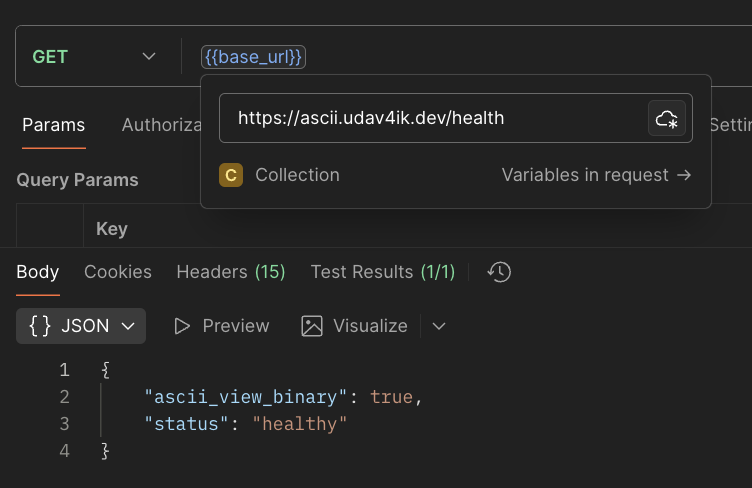
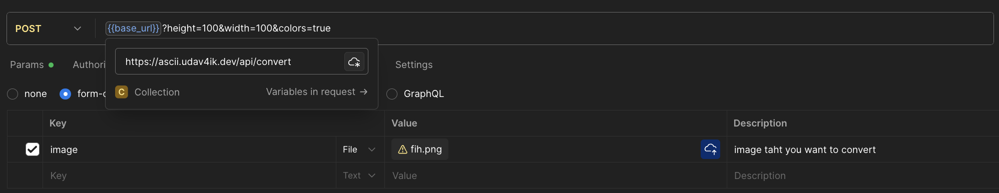
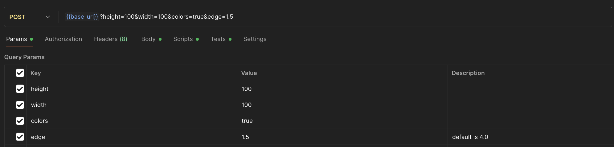

# ASCII Art API Guide

Complete reference for the ASCII Art Converter API.
[https://ascii.udav4ik.dev/api/convert](https://ascii.udav4ik.dev/api/convert)


## Endpoints

### Health Check

**GET** `/health`

Check if the API is running.

**Response:**
```json
{
  "status": "healthy",
  "service": "ASCII Art API"
}
```




---
### Convert Image to ASCII




**POST** `/api/convert`

**Response:**
```json

{
  "ascii": "ASCII art output here...",
  "edge_threshold": null,
  "filename": "name.png",
  "has_colors": false,
  "height": 100,
  "width": 100
}
```
## Parameters Reference

### Width Parameter

**Query:** `width` or `w`  
**Type:** Integer  
**Range:** 10-500  
**Default:** 80  
**Description:** Output width in characters

**Examples:**
```bash
?width=120
?w=120
```

### Height Parameter

**Query:** `height` or `h`  
**Type:** Integer  
**Range:** 10-500  
**Default:** 60  
**Description:** Output height in lines

**Examples:**
```bash
?height=80
?h=80
```

### Colors Parameter

**Query:** `colors`  
**Type:** Boolean  
**Values:** `true` or `false`  
**Default:** false  
**Description:** Include ANSI 24-bit RGB color codes in output

**Examples:**
```bash
?colors=true
?colors=false
```

**Output Differences:**

**Without colors:**
```
@@@@@@@@@@@@
@@@@##@@@@@@
@@@@  @@@@@@
```

**With colors:**
```
\x1b[38;2;45;52;54m@\x1b[38;2;47;54;56m@...
```

### Edge Detection Threshold

**Query:** `et`  or `edge`
**Type:** Float  
**Range:** 0.0-4.0  
**Default:** 4.0 (disabled)  
**Description:** Edge detection sensitivity. Lower values = more edge emphasis

**Examples:**
```bash
?et=2.5  # Moderate edge detection
?et=1.0  # Strong edge detection
?et=4.0  # Disabled (default)
```

**Recommended Values:**
- `0.5-1.5` - Strong edges (logos, icons)
- `2.0-3.0` - Moderate edges (photos)
- `3.5-4.0` - Minimal/no edges (portraits)

## Request Examples

### Basic Conversion

```bash
curl -X POST \
  -F "image=@photo.jpg" \
  https://ascii.udav4ik.dev/api/convert
```

### With Custom Dimensions

```bash
curl -X POST \
  -F "image=@photo.jpg" \
  "https://ascii.udav4ik.dev/api/convert?width=120&height=80"
```

### With Terminal Colors

```bash
curl -X POST \
  -F "image=@photo.jpg" \
  "https://ascii.udav4ik.dev/api/convert?colors=true"
```

### With Edge Detection

```bash
curl -X POST \
  -F "image=@photo.jpg" \
  "https://ascii.udav4ik.dev/api/convert?width=100&height=75&et=2.5"
```

### All Options Combined

```bash
curl -X POST \
  -F "image=@photo.jpg" \
  "https://ascii.udav4ik.dev/api/convert?width=120&height=80&colors=true&et=2.0"
```

### Pretty Print JSON Response

```bash
curl -X POST \
  -F "image=@photo.jpg" \
  "https://ascii.udav4ik.dev/api/convert?colors=true" | jq '.'
```

### Extract Only ASCII Art

```bash
curl -X POST \
  -F "image=@photo.jpg" \
  "https://ascii.udav4ik.dev/api/convert?colors=true" | jq -r '.ascii'
```

### Save ASCII Art to File

```bash
curl -X POST \
  -F "image=@photo.jpg" \
  "https://ascii.udav4ik.dev/api/convert?colors=true" \
  | jq -r '.ascii' > output.txt
```

### Display in Terminal

```bash
curl -s -X POST \
  -F "image=@photo.jpg" \
  "https://ascii.udav4ik.dev/api/convert?width=80&height=60&colors=true" \
  | jq -r '.ascii'
```


## Rate Limiting

The API does not currently implement rate limiting, but it's recommended to:
- Limit concurrent requests to 10 per client
- Wait for previous conversion to complete before starting new one
- Implement client-side throttling for bulk conversions

## File Size Limits

**Recommended:** < 5 MB per image  
**Maximum:** Image dont live for more then 1 minute on server so currently there is no max.

## Supported Image Formats

- JPEG / JPG
- PNG
- BMP
- GIF (first frame only)
- TGA
- PSD (composited view only)
- HDR
- PIC

Powered by [stb_image](https://github.com/nothings/stb) library.

## Version Information

**API Version:** 1.0  
**Last Updated:** October 2025  
**Compatibility:** All modern HTTP clients

---

## Additional Resources

- [Web Interface Demo](https://ascii.udav4ik.dev)
- [Web Interface Demo Code](./index.html)

## Support

For issues, questions, or contributions, please visit the main project repository.

---
